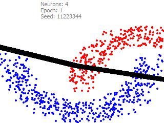
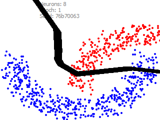
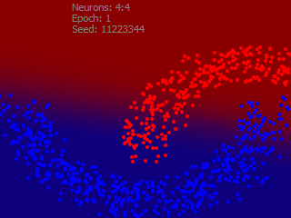
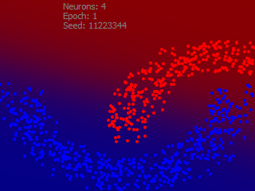
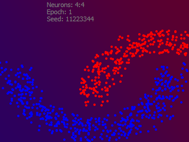

# Machine Learning examples

## Basic classifier

- Stochastic Gradient Descent (SGD) method of learning
- Rectified Linear Unit (ReLU) activation function

  
  

Pure SGD has a high probability of generating a degenerated border, which can be obeserved
over multiple runs. The Solution is Mini-Batch Gradient Descent method. Skip LeakyReLU.

### Add the second layer

  
  

The second layer increases "probability contrast".

### Use Sigmoid activation function in hidden layers instead of ReLU

  
  

  - Sigmoid based system trains much slower
  - Regions border has smooth, organic wavy curves
  - Potential problem: Vanishing Gradaients. Totally makes sense to use mixed Sigmoid/ReLU layers.

### Mini-Batch Gradient Descent
