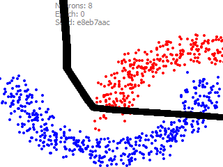
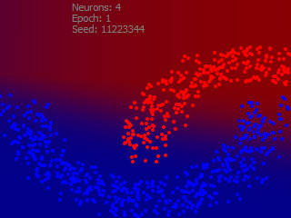
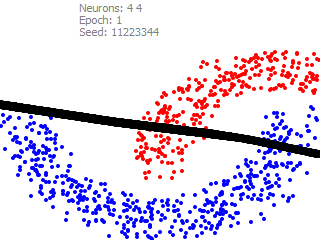

# Machine Learning examples

## Basic classifier

- Stochastic Gradient Descent (SGD) method of learning
- Rectified Linear Unit (ReLU) activation function

  
  

Pure SGD has a high probability of generating a degenerated border, which can be obeserved
over multiple runs. The Solution is Mini-Batch Gradient Descent method. Skip LeakyReLU.

- Add the second layer

  
  

The second layer increases "probability contrast".

- Mini-Batch Gradient Descent