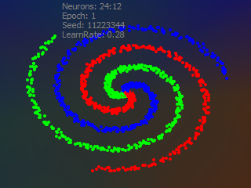
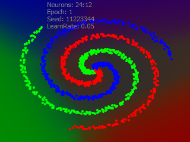

# Machine Learning examples

## Single layer SGD

- Stochastic Gradient Descent (SGD) method of learning
- Rectified Linear Unit (ReLU) activation function

  
  

Pure SGD has a high probability of generating a degenerated border, which can be obeserved
over multiple runs. The Solution is Mini-Batch Gradient Descent method. Skip LeakyReLU.

### Two layers SGD

  
  

The second layer increases "probability contrast".

### Use Sigmoid activation function in hidden layers instead of ReLU

  
  

  - Sigmoid based system trains much slower
  - Regions border has smooth, organic wavy curves
  - Potential problem: Vanishing Gradaients. Totally makes sense to use mixed Sigmoid/ReLU layers.

### Mini-Batch Gradient Descent vs Adam optimizer

  - Batch size for both cases is 32 dots.
  - Two layers system with ReLU: 24 neurons on first layer and 12 on second

  
  

  - Simple mini-batch optimizer uses increased learning rate: 0.05 * sqrt(32), otherwise learning is too slow
  - Adam shows significantly better results in all cases.
